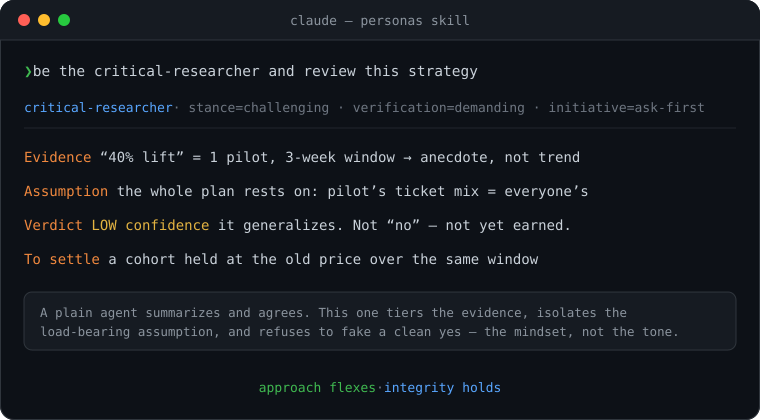

# personas

A [Claude Code](https://claude.com/claude-code) skill that gives any agent an
**operating profile** — not just a voice, but a mindset and working style. A
persona sets *how the agent reasons, how deep it goes, what it prioritizes under
trade-offs, how it handles ambiguity and risk, and how it sounds.*

Built for scenarios where agents act as **AI employees**, each holding a role with
a working style suited to it — a research type that challenges every idea before
it proves true, a sales type that never dead-ends a client but finds a workaround.

<p align="center">
  
</p>

<p align="center"><em>Illustrative — the mindset (evidence-tiering, challenge, confidence) shows up in the work, not just the tone.</em></p>

## The spine

**Approach flexes, integrity holds.**

- **Approach** — reasoning style, depth, priorities, risk posture, and voice — is
  the persona's to reshape. This is what makes a critical researcher genuinely dig
  deeper and a consultative seller genuinely reframe a "no."
- **Integrity floor** — correctness, honesty, safety, and truthful reporting of
  what was actually done — is fixed. No persona lowers it.

The load-bearing line: **a profile may choose to do *less*; it may never *lie*
about having done more.** A move-fast profile checks less and ships sooner — a real
trade-off. It can never *claim* verification it skipped, promise a capability that
doesn't exist, or hide a failure to stay in character. That separation is what
makes it safe to give an autonomous agent a strong personality.

## What's in the box

- **Role profiles** — full operating profiles that change *how work gets done*:
  `critical-researcher`, `consultative-seller`, with more to come. Each declares
  its behavioral axes, a conflict rule, and a fit-to-task note.
- **Voice presets** — lighter personas that change only how the agent *sounds*:
  grumpy staff engineer, hype beast, zen mentor, noir detective, and more.
- **An axis vocabulary** (`operating-dimensions.md`) — eight behavioral dimensions
  for composing your own profiles.
- **Two ways to apply one** — adopt it for the current session, or bake it into a
  reusable `.claude/agents/<name>.md` subagent.

## Install

```bash
# Global (all projects)
git clone https://github.com/qc2174/personas ~/.claude/skills/personas

# Or per-project
git clone https://github.com/qc2174/personas .claude/skills/personas
```

## Use

Ask in plain language:

- "Be the critical researcher and review this strategy doc."
- "Give this agent a sales type — great people skills, never a flat no."
- "Make me a due-diligence agent that challenges every claim before accepting it."
- "Spin up a team: a skeptical analyst, a warm client-facing rep, and an operator."

The skill triggers on any request to shape *how* an agent works or talks — even
without the word "persona."

## Structure

```
personas/
├── SKILL.md                        # the spine + how to apply a profile
├── references/
│   ├── operating-dimensions.md     # the 8 behavioral axes (the vocabulary)
│   ├── preset-library.md           # role profiles + voice presets
│   └── authoring-personas.md       # how to compose / remix your own
└── assets/
    └── persona-template.md         # fill-in-the-blanks starter
```

## Design note

Personas that change *how work gets done* are powerful and risky in the same
breath — the wrong profile on the wrong job (a "ship-it-fast" mindset on a
compliance audit) is a real hazard. Two things keep it safe: the integrity floor
that no profile lowers, and **fit-to-task** — every role profile declares what it
suits and what it must escalate rather than improvise. For a team of AI employees,
that fit note is the contract an orchestrator uses to assign work.

## License

MIT — see [LICENSE](LICENSE).
